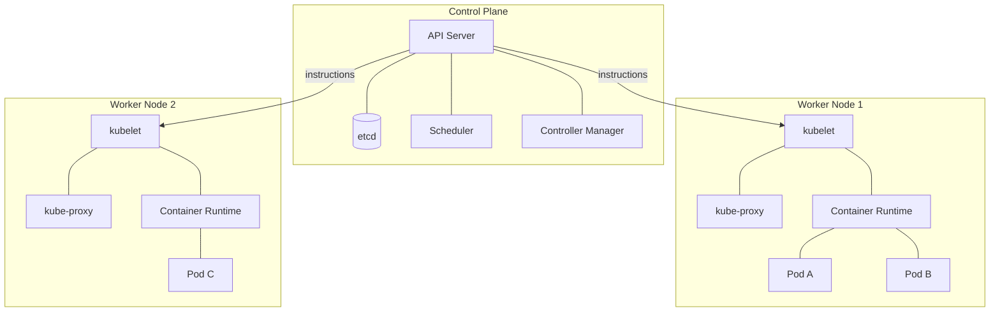
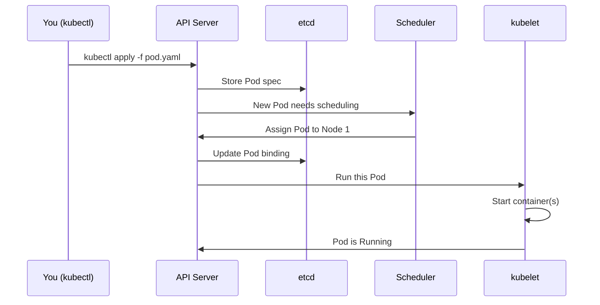
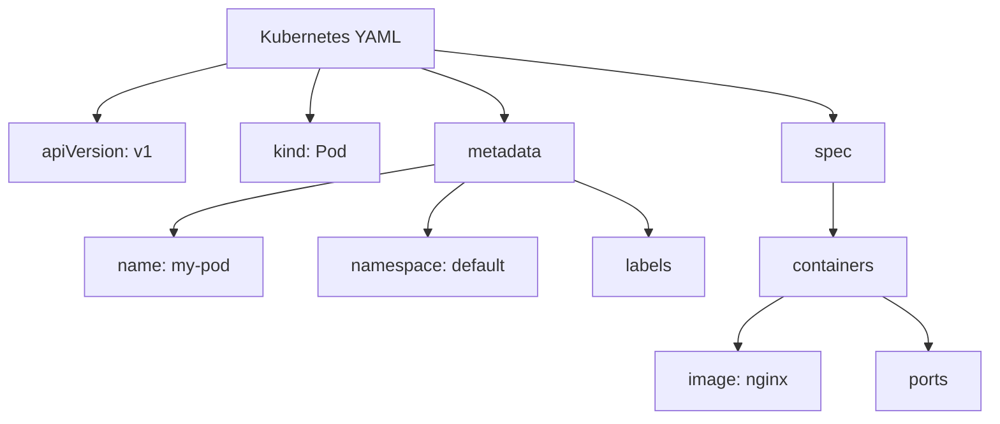
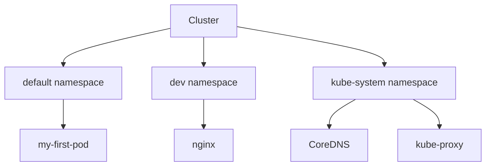

## The Concept

**Kubernetes** is an open-source system for running and managing containerized applications at scale. A **container** is a lightweight, isolated unit that packages your application and its dependencies. When you have many containers across many machines, you need something to decide where each container runs, keep them healthy, and connect them. That is what Kubernetes does: it **orchestrates** containers.

Think of Kubernetes as a building manager for a large apartment complex. Tenants (your applications) live in apartments (containers). The manager (Kubernetes) assigns apartments, handles maintenance, and ensures everyone has what they need. You tell the manager *what* you want (e.g., "I need three copies of my web app running"), and the manager figures out *how* to make it happen.

A **cluster** is your entire Kubernetes setup. It has two main parts: the **Control Plane** (the brain) and the **Worker Nodes** (the workers).

The **Control Plane** runs the cluster. It has four core components:

- **API Server**: The front door. Every request (from you, from other components, from external tools) goes through the API Server. Like a receptionist, it receives requests, validates them, and forwards them to the right place. It is the only component you talk to directly via `kubectl`.

- **etcd**: The database. It stores all cluster state: which Pods exist, what they are running, which nodes they are on, and so on. It is a key-value store that keeps everything consistent.

- **Scheduler**: The assignment manager. When you create a Pod (a unit that wraps one or more containers), the Scheduler decides *which* Worker Node should run it. It considers resource needs, node capacity, and placement rules.

- **Controller Manager**: The maintenance crew. It runs controllers that watch the cluster and fix drift. For example, if you want 3 replicas of an app but only 2 are running, a controller notices and starts the third. It keeps the **desired state** (what you asked for) in sync with the **actual state** (what is really running).

**Worker Nodes** are the machines that run your workloads. Each node has:

- **kubelet**: The agent on each node. It talks to the API Server, receives instructions, and ensures the containers specified for that node are actually running. It is the bridge between the Control Plane and the node.

- **kube-proxy**: Handles networking. It maintains network rules so Pods can talk to each other and to Services (a way to expose Pods over the network).

- **Container runtime**: The software that actually runs containers (e.g., containerd, CRI-O). Kubernetes does not run containers directly; it delegates to a runtime.



Kubernetes uses a **declarative model**. You describe *what* you want (desired state), and Kubernetes figures out *how* to achieve it. You say "I want a Pod running nginx." Kubernetes creates it, monitors it, and restarts it if it crashes. You do not write scripts to start processes; you declare intent.



A **Pod** is the smallest deployable unit in Kubernetes. It wraps one or more containers that share the same network and storage. Containers in a Pod run on the same node and can talk to each other via localhost. Most Pods have a single container; multi-container Pods are used for tightly coupled helpers (e.g., a main app and a log shipper).

**Namespaces** are virtual partitions inside a cluster. They let you organize resources (Pods, Services, etc.) and isolate them by team or environment. The `default` namespace is where resources go if you do not specify one. You can create `dev`, `prod`, `team-a`, and so on.

When you define resources, you use **YAML** (or JSON). Every Kubernetes resource has a similar structure:

- **apiVersion**: Which API version this resource belongs to (e.g., `v1` for Pods, `apps/v1` for Deployments).
- **kind**: The type of resource (Pod, Service, Deployment, etc.).
- **metadata**: Identifying information: name, namespace, labels.
- **spec**: The desired configuration. For a Pod, this includes which containers to run, their images, ports, and more.

YAML is whitespace-sensitive: use spaces, never tabs. Indentation defines structure.



---

## Beginner Tutorial

Follow these steps to build hands-on familiarity with the cluster and core resources.

1. **Create a local cluster with kind.** If you have not already, install kind and kubectl using the [Setup.md](../../Setup.md) guide. Then run:
   ```bash
   kind create cluster --name ckad
   ```
   This creates a single-node cluster named `ckad`. The node runs both the Control Plane and workloads.

2. **Run `kubectl cluster-info` and explain the output.**
   ```bash
   kubectl cluster-info
   ```
   Expected output (abbreviated):
   ```
   Kubernetes control plane is running at https://127.0.0.1:xxxxx
   CoreDNS is running at https://127.0.0.1:xxxxx/api/v1/namespaces/kube-system/services/kube-dns:dns/proxy
   ```
   This shows the API Server address (the control plane endpoint) and that CoreDNS (the cluster DNS) is running.

3. **Run `kubectl get nodes` — explain Ready status.**
   ```bash
   kubectl get nodes
   ```
   Expected output:
   ```
   NAME                 STATUS   ROLES           AGE   VERSION
   ckad-control-plane   Ready    control-plane   1m    v1.28.x
   ```
   `Ready` means the node is healthy and can accept workloads. The kubelet has reported that the node is ready to the API Server.

4. **Write a Pod YAML from scratch.** Create a file `pod.yaml`:
   ```yaml
   apiVersion: v1
   kind: Pod
   metadata:
     name: my-first-pod
     labels:
       app: hello
   spec:
     containers:
       - name: hello
         image: nginx:alpine
         ports:
           - containerPort: 80
   ```



5. **Apply it with `kubectl apply -f pod.yaml`.**
   ```bash
   kubectl apply -f pod.yaml
   ```
   Expected output:
   ```
   pod/my-first-pod created
   ```

6. **Explore with common kubectl commands.**
   ```bash
   kubectl get pods
   ```
   Expected (once the Pod is running):
   ```
   NAME           READY   STATUS    RESTARTS   AGE
   my-first-pod   1/1     Running   0          30s
   ```
   ```bash
   kubectl describe pod my-first-pod
   ```
   This shows detailed info: IP, node, events, container status. Check the Events section at the bottom for scheduling and startup messages.
   ```bash
   kubectl logs my-first-pod
   ```
   Shows the nginx container's stdout logs.

7. **Exec into it.**
   ```bash
   kubectl exec -it my-first-pod -- /bin/sh
   ```
   You are now inside the container. Run `ls`, `cat /etc/nginx/nginx.conf`, then type `exit` to leave.

8. **Create a namespace.**
   ```bash
   kubectl create namespace dev
   ```
   Output: `namespace/dev created`

9. **Deploy a pod in that namespace.**
   ```bash
   kubectl run nginx --image=nginx -n dev
   ```
   This creates a Pod named `nginx` in the `dev` namespace using the imperative `run` command.

10. **Switch context namespace.**
    ```bash
    kubectl config set-context --current --namespace=dev
    ```
    Now `kubectl get pods` (without `-n`) shows Pods in `dev` by default.

11. **Use `kubectl explain` to discover fields.**
    ```bash
    kubectl explain pod.spec.containers
    ```
    This prints the schema for the `containers` field. Use it during the exam to recall field names and structure.

12. **Use `kubectl api-resources` to list all resource types.**
    ```bash
    kubectl api-resources
    ```
    Shows resource names, short names (e.g., `po` for pods), API group, and whether they are namespaced.

13. **Delete resources and clean up.**
    ```bash
    kubectl delete pod my-first-pod
    kubectl delete pod nginx -n dev
    kubectl delete namespace dev
    kubectl config set-context --current --namespace=default
    kind delete cluster --name ckad
    ```

---

## Hands-On Lab

Four performance-based challenges. Complete each and verify the success criteria.

### Challenge 1: "Explore the Cluster"

**Scenario:** You just joined a team. Inspect the cluster — find how many nodes exist, what version of Kubernetes is running, and list all namespaces. Write your findings to a file `/tmp/cluster-info.txt`.

**Success criteria:** The file contains the node count, Kubernetes version, and a list of namespaces.

<details>
<summary>Hints</summary>

- Use `kubectl get nodes` for node count.
- Use `kubectl version` (client and server) or `kubectl get nodes -o wide` for version.
- Use `kubectl get namespaces` for namespaces.
- Redirect output to the file with `>` or append with `>>`.
</details>

### Challenge 2: "Create a Pod from Scratch"

**Scenario:** Create a Pod named `inspector` running `busybox` with command `sleep 3600`. Exec into it, install `wget`, and fetch the Kubernetes API server's `/version` endpoint from inside the Pod. Hint: the API server is at `https://kubernetes.default.svc`.

**Success criteria:** The Pod runs, you exec into it, and you successfully fetch and view the `/version` response.

<details>
<summary>Hints</summary>

- Use a Pod YAML with `command: ["sleep", "3600"]` in the container spec.
- BusyBox uses `apk add wget` (Alpine) or `opkg install wget` depending on the image. Use `busybox:1.36` or similar.
- The API server URL is `https://kubernetes.default.svc/version`. You may need to skip TLS verification: `wget -qO- --no-check-certificate https://kubernetes.default.svc/version`.
- Or use `curl -k` if curl is available.
</details>

### Challenge 3: "Namespace Isolation"

**Scenario:** Create two namespaces `team-a` and `team-b`. Deploy an nginx Pod in each. Verify that `kubectl get pods` (without `-n`) shows nothing (because you're in the default namespace). Then switch to `team-a` and verify you see only that namespace's Pod.

**Success criteria:** Both namespaces exist, each has an nginx Pod, default context shows no Pods, and after switching to `team-a` you see only the `team-a` Pod.

<details>
<summary>Hints</summary>

- Create namespaces with `kubectl create namespace team-a` and `team-b`.
- Deploy with `kubectl run nginx --image=nginx -n team-a` and similarly for `team-b`.
- Ensure your context namespace is `default` before the first `kubectl get pods`.
- Switch with `kubectl config set-context --current --namespace=team-a`.
</details>

### Challenge 4: "Fix a Broken Pod"

**Scenario:** Apply this broken YAML and fix it. The Pod should end up Running.

Broken version (with intentional errors: wrong apiVersion, missing image field, typo in container name):

```yaml
apiVersion: apps/v1
kind: Pod
metadata:
  name: broken-pod
spec:
  containers:
    - name: ngnix
```

**Success criteria:** Fix the wrong apiVersion (use `v1` for Pods), add the missing `image` field, correct the container name typo (`ngnix` to `nginx`), and ensure the Pod runs.

<details>
<summary>Hints</summary>

- Pods use `apiVersion: v1`, not `apps/v1` (that is for Deployments).
- Every container must have an `image` field.
- Use `kubectl apply -f` after fixing. Check `kubectl describe pod broken-pod` if it fails.
</details>

---

## Weekly Speed Drill

15-minute timed challenge. Complete these 10 tasks as fast as possible using imperative commands.

1. Create a namespace called `drill`
2. Run an nginx pod in the `drill` namespace
3. Get all pods across all namespaces
4. Describe the nginx pod
5. Get the pod's YAML output
6. Get just the pod's IP using jsonpath
7. Exec into the pod and run `hostname`
8. Check pod logs
9. Delete the pod with `--force --grace-period=0`
10. Delete the namespace

**Commands:**

```bash
# 1
kubectl create namespace drill

# 2
kubectl run nginx --image=nginx -n drill --restart=Never

# 3
kubectl get pods -A

# 4
kubectl describe pod nginx -n drill

# 5
kubectl get pod nginx -n drill -o yaml

# 6
kubectl get pod nginx -n drill -o jsonpath='{.status.podIP}'

# 7
kubectl exec -it nginx -n drill -- hostname

# 8
kubectl logs nginx -n drill

# 9
kubectl delete pod nginx -n drill --force --grace-period=0

# 10
kubectl delete namespace drill
```

---

## Exam Pitfalls

Common mistakes that cost points on the CKAD exam:

**1. Forgetting to specify `-n <namespace>`**

Many tasks require working in a specific namespace. If you omit `-n`, kubectl uses the current context namespace (often `default`). You might create or inspect resources in the wrong place. Always check the task for the target namespace and add `-n <namespace>` to every relevant command.

**2. Using `kubectl create` vs `kubectl apply`**

`kubectl create` fails if the resource already exists. `kubectl apply` is idempotent: it creates the resource if it does not exist, or updates it if it does. For declarative workflows and re-running commands, prefer `apply -f`. Use `create` only when you explicitly want to fail on duplicates.

**3. Not knowing how to use `kubectl explain`**

During the exam, you cannot browse the web. `kubectl explain` is the built-in documentation. Use `kubectl explain pod`, `kubectl explain pod.spec.containers`, etc., to recall field names and structure. Practice it until it is second nature.

**4. Forgetting labels on Pods**

Services select Pods by labels. If you create a Pod without labels (or with wrong labels), a Service will not find it and traffic will not flow. Always add meaningful labels like `app: myapp` when creating Pods that need to be exposed.

**5. Wrong apiVersion**

Pods use `apiVersion: v1`. Deployments use `apiVersion: apps/v1`. ConfigMaps and Secrets use `v1`. Using the wrong apiVersion causes validation errors. When in doubt, run `kubectl explain <resource>` to see the correct apiVersion.

**6. Typos in YAML indentation**

YAML is whitespace-sensitive. Use spaces, never tabs. Incorrect indentation leads to "mapping values are not allowed" or "expected key" errors. Align nested keys under their parent. A common mistake is misaligning `containers` under `spec`.

**7. Not checking events when a Pod won't start**

If a Pod is stuck in Pending, CrashLoopBackOff, or ImagePullBackOff, run `kubectl describe pod <name>`. The Events section at the bottom explains why: scheduling failures, image pull errors, crash reasons. Skipping this wastes time guessing.

**8. Forgetting `--restart=Never` when creating a one-off Pod with `kubectl run`**

By default, `kubectl run` creates a Deployment (which creates ReplicaSets and Pods). For a single, one-off Pod, you must add `--restart=Never`. Otherwise you get a Deployment when the task asks for a Pod.

---

## Solution Key

### Challenge 1: Explore the Cluster

```bash
kubectl get nodes
kubectl version
kubectl get namespaces

{
  echo "Node count: $(kubectl get nodes --no-headers | wc -l)"
  echo "Kubernetes version:"
  kubectl version -o yaml
  echo "Namespaces:"
  kubectl get namespaces
} > /tmp/cluster-info.txt

cat /tmp/cluster-info.txt
```

Expected snippet in `/tmp/cluster-info.txt`:
```
Node count: 1
Kubernetes version:
clientVersion: ...
serverVersion:
  gitVersion: v1.28.x
  ...
Namespaces:
NAME              STATUS   AGE
default           Active
kube-system       Active
...
```

---

### Challenge 2: Create a Pod from Scratch

**Pod YAML (`inspector-pod.yaml`):**

```yaml
apiVersion: v1
kind: Pod
metadata:
  name: inspector
spec:
  containers:
    - name: inspector
      image: busybox:1.36
      command: ["sleep", "3600"]
```

**Commands:**

```bash
kubectl apply -f inspector-pod.yaml

kubectl get pod inspector -w
# Ctrl+C when Running

kubectl exec -it inspector -- /bin/sh
# Inside the container:
# apk add --no-cache wget
# wget -qO- --no-check-certificate https://kubernetes.default.svc/version
# exit
```

Expected output from wget (inside the Pod):
```json
{
  "major": "1",
  "minor": "28",
  ...
}
```

---

### Challenge 3: Namespace Isolation

```bash
kubectl create namespace team-a
kubectl create namespace team-b

kubectl run nginx --image=nginx -n team-a --restart=Never
kubectl run nginx --image=nginx -n team-b --restart=Never

kubectl config set-context --current --namespace=default

kubectl get pods
# Expected: No resources found in default namespace.

kubectl config set-context --current --namespace=team-a

kubectl get pods
# Expected: Only the team-a nginx pod appears.
```

---

### Challenge 4: Fix a Broken Pod

**Fixed YAML (`fixed-pod.yaml`):**

```yaml
apiVersion: v1
kind: Pod
metadata:
  name: broken-pod
spec:
  containers:
    - name: nginx
      image: nginx:alpine
```

**Commands:**

```bash
kubectl delete pod broken-pod --ignore-not-found

kubectl apply -f fixed-pod.yaml

kubectl get pod broken-pod
# Expected: STATUS = Running
```

---

*Next: Week 3 — Workloads and Controllers.*
