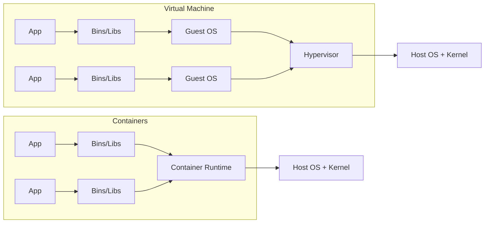
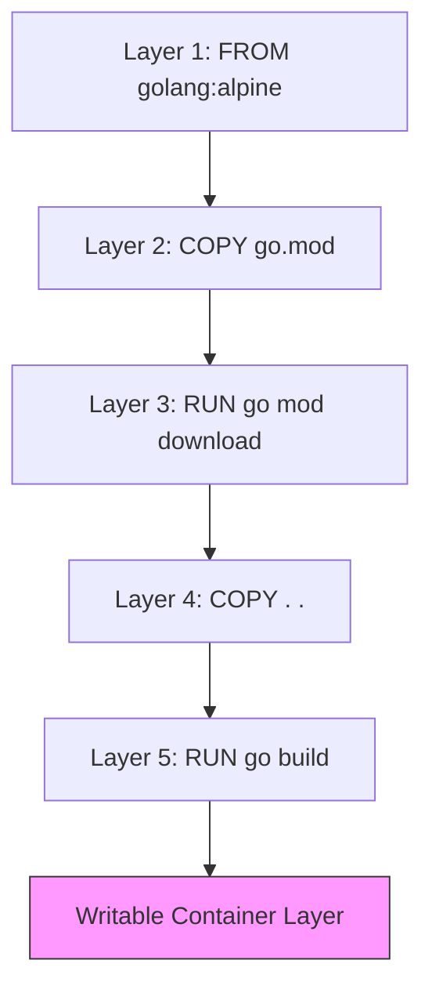
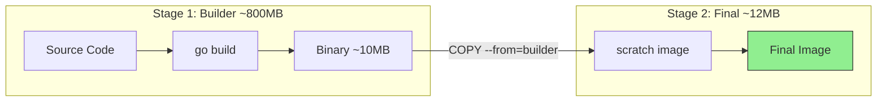
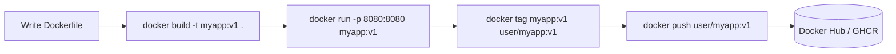

# Week 1: Containers & Docker Fundamentals

## The Concept

Before diving into commands, you need a clear mental model of what containers are and how they fit together. This section defines every term before using it.

**What is a container?** A container is a lightweight, isolated environment that runs a single process (or a small group of related processes). Think of it like a shipping container: it holds everything your application needs to run—code, dependencies, and configuration—in a standardized box. The key word is *isolated*: each container has its own filesystem, network, and process space, but unlike a virtual machine, it does *not* include a full copy of an operating system. Containers share the host kernel (the core of the operating system) with the host machine and with other containers. This makes them much smaller and faster to start than virtual machines. A VM might take minutes to boot; a container starts in seconds.



**What is a Docker image?** An image is a read-only template that defines exactly what goes inside a container. It is built in layers, like a stack of transparencies. Each layer adds or changes files. Images follow the OCI (Open Container Initiative) format, which is an industry standard—so an image built with Docker can run on Podman, containerd, or Kubernetes without changes. When you run a container, Docker creates a thin writable layer on top of the image; that layer is discarded when the container stops unless you explicitly save it.

**What is a Dockerfile?** A Dockerfile is a text file that contains instructions for building an image. You write it; Docker reads it and executes each instruction to produce layers. The main instructions you will use:

- **FROM** — Specifies the base image. Every image starts from another image (or `scratch`, meaning "empty"). Example: `FROM golang:1.21-alpine`.
- **COPY** — Copies files from your machine into the image. Example: `COPY . /app`.
- **RUN** — Runs a command inside the image during build. Example: `RUN go build -o /app/server .`
- **EXPOSE** — Documents which port the app listens on. It does *not* publish the port; you need `-p` when running the container.
- **ENTRYPOINT** — The executable that runs when the container starts. It is hard to override.
- **CMD** — Default arguments passed to the ENTRYPOINT (or the command to run if there is no ENTRYPOINT). Easier to override with `docker run`.

**Image layers and caching** — Each instruction in a Dockerfile creates a layer. Docker caches layers: if an instruction and everything before it are unchanged, Docker reuses the cached layer. If you change one line, every layer after it is rebuilt. That is why order matters: put rarely changing instructions (like copying `go.mod` and `go.sum`) first, and frequently changing instructions (like copying source code) last. Copying dependencies before source code means dependency layers are cached even when you edit your Go files.



**Container registries** — A registry is a storage and distribution service for images. Docker Hub is the default public registry (like GitHub for images). GitHub Container Registry (GHCR) is another option, often used for images built from GitHub repos. You push images with `docker push` and pull them with `docker pull`.

**Multi-stage builds** — A Dockerfile can have multiple `FROM` instructions. Each `FROM` starts a new stage. You can copy artifacts from one stage to another. For Go, this is crucial: you build in a stage that has the Go compiler (a large image, often 800MB+), then copy only the compiled binary into a minimal stage (e.g., `scratch` or `alpine`). The final image can be under 15MB because it contains no compiler, no source code, and no build tools—just the binary.



---

## Beginner Tutorial

Follow these steps in order. Run each command and observe the output.

### 1. Install Docker

Install Docker Engine for your platform using the official guide: [https://docs.docker.com/engine/install/](https://docs.docker.com/engine/install/).

Verify the installation:

```bash
docker --version
```

You should see output like `Docker version 24.0.x, build xxxxx`.

### 2. Run hello-world

```bash
docker run hello-world
```

Docker will pull the `hello-world` image (if not already present), create a container from it, run it, and print a message. The container exits immediately. This confirms Docker is working.

### 3. Write a Go HTTP server and Dockerfile

Create a new directory and add this Go file `main.go`:

```go
package main

import (
	"encoding/json"
	"log"
	"net/http"
)

func main() {
	http.HandleFunc("/", func(w http.ResponseWriter, r *http.Request) {
		w.Header().Set("Content-Type", "application/json")
		json.NewEncoder(w).Encode(map[string]string{"status": "ok"})
	})
	log.Fatal(http.ListenAndServe(":8080", nil))
}
```

Create `go.mod`:

```bash
go mod init myapp
```

Create this `Dockerfile`:

```dockerfile
FROM golang:1.21-alpine
WORKDIR /app
COPY . .
RUN go build -o server .
EXPOSE 8080
CMD ["./server"]
```

### 4. Build the image

From the same directory:

```bash
docker build -t myapp:v1 .
```

The `-t` flag tags the image as `myapp:v1`. The `.` means "use the current directory as build context."

### 5. Run the container and test it

```bash
docker run -p 8080:8080 myapp:v1
```

The `-p 8080:8080` maps port 8080 on your host to port 8080 in the container. In another terminal:

```bash
curl http://localhost:8080
```

You should see `{"status":"ok"}`. Stop the container with Ctrl+C.

### 6. Explore exec, logs, and inspect

Run the container in the background (detached):

```bash
docker run -d -p 8080:8080 --name myapp-container myapp:v1
```

**Exec** — Run a command inside the running container:

```bash
docker exec myapp-container ls -la /app
```

**Logs** — View stdout/stderr:

```bash
docker logs myapp-container
```

**Inspect** — Get detailed JSON metadata:

```bash
docker inspect myapp-container
```

Stop and remove:

```bash
docker stop myapp-container && docker rm myapp-container
```

### 7. Multi-stage build

Compare image sizes. First, build with the single-stage Dockerfile above and check size:

```bash
docker build -t myapp:single .
docker images myapp:single
```

You will see an image around 300–400MB (or more with golang:1.21).

Now use this multi-stage Dockerfile:

```dockerfile
FROM golang:1.21-alpine AS builder
WORKDIR /app
COPY go.mod go.sum ./
RUN go mod download
COPY . .
RUN CGO_ENABLED=0 go build -o server .

FROM scratch
COPY --from=builder /app/server /server
EXPOSE 8080
ENTRYPOINT ["/server"]
```

Build and compare:

```bash
docker build -t myapp:multi .
docker images myapp:multi
```

The multi-stage image should be around 10–15MB.



### 8. Tag and push to Docker Hub

Log in (create an account at hub.docker.com if needed):

```bash
docker login
```

Tag your image for your Docker Hub username (replace `YOUR_USERNAME`):

```bash
docker tag myapp:multi YOUR_USERNAME/myapp:v1
```

Push:

```bash
docker push YOUR_USERNAME/myapp:v1
```

---

## Hands-On Lab

Complete these four challenges. Each has clear success criteria and optional hints.

### Build and Optimize

You are given a Go web app that returns `{"message":"hello"}` on port 8080. The current Dockerfile uses `FROM golang:1.21` and produces an image over 800MB. Your task is to reduce the final image size to under 20MB using a multi-stage build. The app must still respond correctly to `curl http://localhost:8080`.

**Success criteria:** `docker images` shows your image under 20MB, and `curl http://localhost:8080` returns valid JSON.

<details>
<summary>Hints</summary>

- Use a builder stage with `golang:1.21-alpine` (or similar) to compile.
- Use `CGO_ENABLED=0` so the binary is statically linked and can run in `scratch`.
- Copy only the binary to the final stage. Use `scratch` or `alpine` as the final base.
- Ensure the final stage has `EXPOSE 8080` and the correct `ENTRYPOINT` or `CMD`.
</details>

### Debug a Broken Build

A Dockerfile is provided that fails to build or run. It has three deliberate mistakes:

1. Wrong `WORKDIR` (path does not match where files are copied).
2. Missing `COPY` (source code is never copied into the image).
3. Wrong `ENTRYPOINT` (points to a non-existent binary or wrong path).

Fix all three so the image builds and the container runs successfully.

**Success criteria:** `docker build` completes without error, and `docker run` starts a container that serves the app correctly.

<details>
<summary>Hints</summary>

- Verify `WORKDIR` matches the paths used in `COPY` and `RUN`.
- Ensure every file needed for the build is copied (e.g., `go.mod`, `go.sum`, `*.go`).
- Check that `ENTRYPOINT` or `CMD` references the actual binary path produced by `go build`.
</details>

### Environment Variables

Modify the Go app so it reads the port from an environment variable `APP_PORT` (default 8080 if unset). Then run the container with `docker run -e APP_PORT=3000 -p 3000:3000 myapp` and verify the app listens on port 3000.

**Success criteria:** The app listens on the port specified by `APP_PORT`, and `curl` to that port returns the expected response.

<details>
<summary>Hints</summary>

- Use `os.Getenv("APP_PORT")` and fall back to `"8080"` if empty.
- Use `net.Listen` and `http.Server` to bind to the chosen port, or parse the port and pass it to `ListenAndServe`.
- Remember to map the correct host port with `-p` when running.
</details>

### Layer Caching Optimization

A Dockerfile copies all source code first, then runs `go mod download` and `go build`. This invalidates the cache on every code change. Reorder the Dockerfile so that:

1. `go.mod` and `go.sum` are copied first.
2. `go mod download` runs next.
3. Source code is copied last.
4. `go build` runs after.

**Success criteria:** Changing a single `.go` file and rebuilding does not re-run `go mod download`; only the copy and build steps run.

<details>
<summary>Hints</summary>

- Copy `go.mod` and `go.sum` in a separate `COPY` before copying the rest.
- Run `go mod download` before copying source. Dependencies change less often than code.
- Copy `*.go` or `.` last, then run `go build`.
</details>

---

## Weekly Speed Drill

Set a 15-minute timer. Complete these 10 tasks as fast as you can using imperative Docker commands.

1. Pull the `nginx:alpine` image.
2. Run it detached (`-d`) mapping host port 9090 to container port 80.
3. List running containers.
4. Exec into the container and create a file (e.g., `touch /usr/share/nginx/html/test.txt`).
5. View the container logs.
6. Stop and remove the container.
7. Build a Go app image tagged `myapp:v2`.
8. List all images and filter by `myapp`.
9. Remove the `myapp:v2` image.
10. Run a container that auto-removes on exit (`--rm`).

---

### CKAD Speed Aliases

Add these to your shell config (`.bashrc` or `.zshrc`) for faster kubectl usage:

```bash
alias k='kubectl'
alias kn='kubectl config set-context --current --namespace'
alias kgp='kubectl get pods'
alias kgs='kubectl get svc'
alias kgd='kubectl get deployments'
alias kga='kubectl get all'
alias kdp='kubectl describe pod'
alias kaf='kubectl apply -f'
alias kdf='kubectl delete -f'
alias kex='kubectl explain'
alias klo='kubectl logs'
alias kpf='kubectl port-forward'
alias kdry='kubectl run --dry-run=client -o yaml'
alias ke='kubectl edit'
```

### Imperative kubectl Commands

```bash
k run nginx --image=nginx
k run mypod --image=busybox --dry-run=client -o yaml > pod.yaml
k create deployment myapp --image=nginx --replicas=3
k expose deployment myapp --port=80 --target-port=80
k create configmap myconfig --from-literal=key1=value1
k create secret generic mysecret --from-literal=password=s3cret
k delete pod nginx --grace-period=0 --force
```

### kubectl Autocompletion

**Bash:**

```bash
# Add to ~/.bashrc
source <(kubectl completion bash)
alias k=kubectl
complete -o default -F __start_kubectl k
```

**Zsh:**

```bash
# Add to ~/.zshrc
source <(kubectl completion zsh)
alias k=kubectl
compdef __start_kubectl k
```

---

## Exam Pitfalls

Avoid these common mistakes when working with Docker and containers.

**1. Forgetting to expose ports**

`EXPOSE` in a Dockerfile only documents the port; it does not publish it. You must use `-p` (or `-P`) with `docker run` to map the port to the host. Without `-p`, the app listens inside the container but is unreachable from outside.

**2. Using CMD when ENTRYPOINT is needed (and vice versa)**

`CMD` is easily overridden by arguments to `docker run`. If you need a fixed executable (e.g., your binary) that should not be overridden, use `ENTRYPOINT`. Use `CMD` for default arguments. For a single binary, `ENTRYPOINT ["/server"]` is often correct; `CMD ["./server"]` can be accidentally replaced.

**3. Not using .dockerignore**

Without a `.dockerignore`, the build context includes everything in the directory: `.git`, `node_modules`, build artifacts, etc. This bloats the context, slows builds, and can leak secrets. Add a `.dockerignore` with entries like `*.md`, `.git`, `vendor`, and any large or sensitive paths.

**4. Building with CGO enabled**

Go binaries are often built with CGO (C bindings) by default on some systems. A CGO binary may depend on glibc and will not run in `scratch` or minimal Alpine. Always use `CGO_ENABLED=0` when building for containers if you plan to use `scratch` or a minimal base.

**5. Confusing image tags**

`latest` is a tag, not "the newest version." It can point to any image the author last pushed. In production, use explicit version tags (e.g., `myapp:v1.2.3`). Avoid relying on `latest` for reproducibility.

**6. Forgetting GOOS=linux when cross-compiling**

If you build on macOS or Windows, the default target is your host OS. Containers usually run Linux. Use `GOOS=linux GOARCH=amd64 go build` (or `arm64` for ARM) so the binary runs correctly in a Linux container.

**7. Running as root when not necessary**

Containers often run as root by default. This increases risk if the container is compromised. Use a non-root user when possible: add `USER nobody` or create a dedicated user in the Dockerfile, and ensure file permissions allow that user to run the app.

**8. Wrong WORKDIR or COPY paths**

If `WORKDIR` is `/app` but you `COPY . .` and the build expects files in a different location, or if `ENTRYPOINT` points to `/server` but the binary is at `/app/server`, the container will fail. Double-check that paths are consistent across `WORKDIR`, `COPY`, `RUN`, and `ENTRYPOINT`/`CMD`.

---

## Solution Key

### Challenge 1: Build and Optimize

**Go app (`main.go`):**

```go
package main

import (
	"encoding/json"
	"log"
	"net/http"
)

func main() {
	http.HandleFunc("/", func(w http.ResponseWriter, r *http.Request) {
		w.Header().Set("Content-Type", "application/json")
		json.NewEncoder(w).Encode(map[string]string{"message": "hello"})
	})
	log.Fatal(http.ListenAndServe(":8080", nil))
}
```

**Optimized Dockerfile:**

```dockerfile
FROM golang:1.21-alpine AS builder
WORKDIR /app
COPY go.mod go.sum ./
RUN go mod download
COPY . .
RUN CGO_ENABLED=0 go build -o server .

FROM scratch
COPY --from=builder /app/server /server
EXPOSE 8080
ENTRYPOINT ["/server"]
```

**Commands:**

```bash
go mod init myapp
docker build -t myapp:optimized .
docker run -p 8080:8080 myapp:optimized
# In another terminal:
curl http://localhost:8080
docker images myapp:optimized
```

**Expected output:** Image size under 20MB; `curl` returns `{"message":"hello"}`.

---

### Challenge 2: Debug a Broken Build

**Broken Dockerfile (example):**

```dockerfile
FROM golang:1.21-alpine
WORKDIR /wrong
COPY go.mod go.sum ./
RUN go mod download
# Missing: COPY . .
RUN go build -o server .
EXPOSE 8080
ENTRYPOINT ["/wrong/binary"]
```

**Fixed Dockerfile:**

```dockerfile
FROM golang:1.21-alpine
WORKDIR /app
COPY go.mod go.sum ./
RUN go mod download
COPY . .
RUN go build -o server .
EXPOSE 8080
ENTRYPOINT ["/app/server"]
```

**Commands:**

```bash
docker build -t myapp:fixed .
docker run -p 8080:8080 myapp:fixed
curl http://localhost:8080
```

---

### Challenge 3: Environment Variables

**Modified Go code:**

```go
package main

import (
	"encoding/json"
	"log"
	"net/http"
	"os"
)

func main() {
	port := os.Getenv("APP_PORT")
	if port == "" {
		port = "8080"
	}
	http.HandleFunc("/", func(w http.ResponseWriter, r *http.Request) {
		w.Header().Set("Content-Type", "application/json")
		json.NewEncoder(w).Encode(map[string]string{"status": "ok"})
	})
	log.Fatal(http.ListenAndServe(":"+port, nil))
}
```

**Commands:**

```bash
docker build -t myapp:env .
docker run -e APP_PORT=3000 -p 3000:3000 myapp:env
curl http://localhost:3000
```

**Expected output:** `{"status":"ok"}` on port 3000.

---

### Challenge 4: Layer Caching Optimization

**Before (poor caching):**

```dockerfile
FROM golang:1.21-alpine
WORKDIR /app
COPY . .
RUN go mod download && go build -o server .
EXPOSE 8080
CMD ["./server"]
```

**After (optimized):**

```dockerfile
FROM golang:1.21-alpine
WORKDIR /app
COPY go.mod go.sum ./
RUN go mod download
COPY . .
RUN go build -o server .
EXPOSE 8080
CMD ["./server"]
```

**Verification:**

```bash
docker build -t myapp:cache .
# Edit main.go (e.g., add a comment)
docker build -t myapp:cache .
# Second build should show "CACHED" for the go mod download step
```

---

### Speed Drill Commands Reference

```bash
# 1
docker pull nginx:alpine

# 2
docker run -d -p 9090:80 --name nginx-test nginx:alpine

# 3
docker ps

# 4
docker exec nginx-test touch /usr/share/nginx/html/test.txt

# 5
docker logs nginx-test

# 6
docker stop nginx-test && docker rm nginx-test

# 7
docker build -t myapp:v2 .

# 8
docker images myapp

# 9
docker rmi myapp:v2

# 10
docker run --rm alpine echo "done"
```
