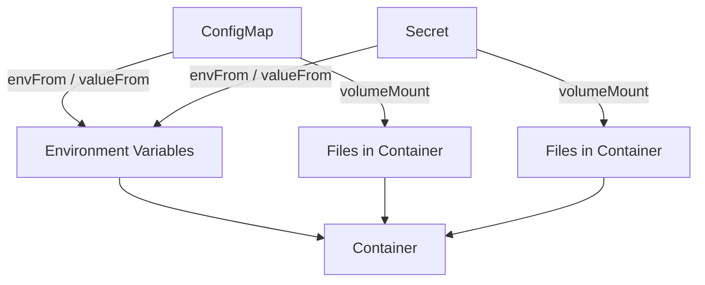
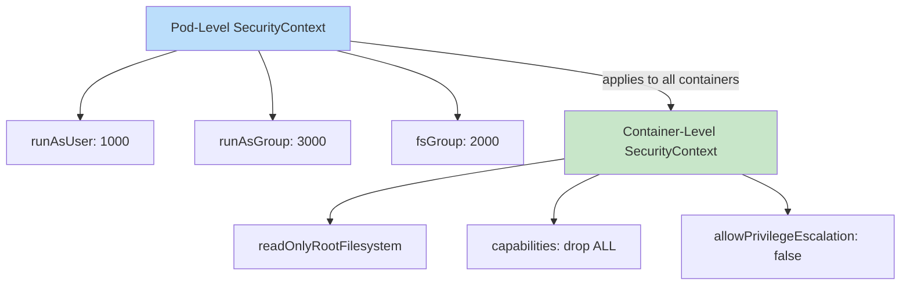
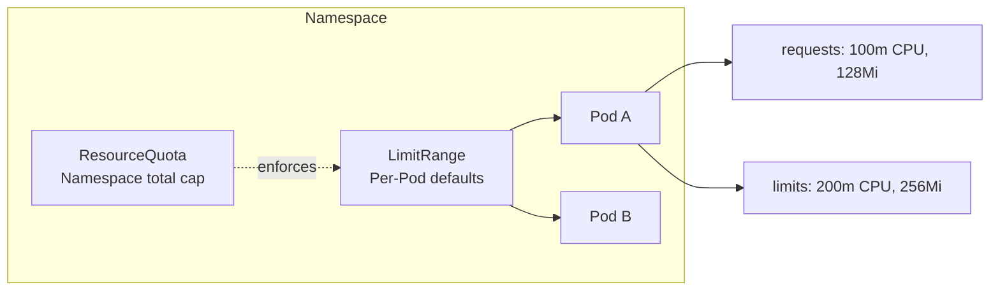
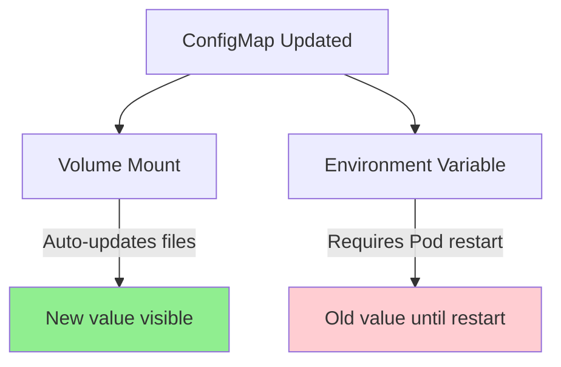

# Week 4: Configuration — ConfigMaps, Secrets & SecurityContext

## The Concept

Before diving into commands, you need a clear mental model of how configuration and security work in Kubernetes. This section defines every term before using it.

**ConfigMap** — A ConfigMap stores non-sensitive configuration as key-value pairs. Think of it as a settings file that lives in the cluster. Instead of baking configuration into your container image (which would require rebuilding the image for every config change), you store it in a ConfigMap and inject it into your Pods at runtime. Examples: database hostnames, feature flags, log levels. ConfigMaps are namespace-scoped: they exist in one namespace and can only be used by Pods in that namespace.

**Secret** — A Secret is like a ConfigMap but designed for sensitive data: passwords, API tokens, TLS certificates. Kubernetes stores Secret data as Base64-encoded strings. Base64 is an encoding scheme, not encryption: it converts binary data to text so it can be stored in YAML, but anyone with cluster access can decode it. Do not rely on Secrets for true confidentiality unless you enable encryption at rest. Use Secrets to avoid putting plain-text passwords in Pod specs or images.

**Two ways to inject config into a container** — You can expose ConfigMaps and Secrets to your application in two ways. First, as environment variables: the key becomes the variable name, the value becomes the variable value. The app reads them via `process.env` or `os.environ`. Environment variables are set once when the container starts and do not change if the ConfigMap or Secret is updated later. Second, as volume mounts: Kubernetes creates a directory and populates it with files, one file per key. The filename is the key; the file content is the value. Volume-mounted files are updated periodically (typically within a minute) when the ConfigMap or Secret changes, so your app can pick up new config without a restart. Use env vars when you need a small set of values and the app does not support file-based config. Use volume mounts when you have many keys, large config files, or need hot-reload behavior.



**SecurityContext** — A SecurityContext controls security settings for a Pod or container. Key fields: `runAsUser` (run the process as a specific user ID instead of root), `runAsNonRoot` (reject if the image runs as root), `readOnlyRootFilesystem` (make the root filesystem read-only so the container cannot write outside designated paths), and `capabilities` (add or drop Linux capabilities such as `NET_BIND_SERVICE` or `CAP_SYS_ADMIN`). SecurityContext can be set at the Pod level (applies to all containers) or at the container level (overrides Pod-level for that container). Capabilities are container-level only.



**ServiceAccount** — A ServiceAccount is an identity for Pods to authenticate with the Kubernetes API. Every Pod gets a default ServiceAccount (`default`) in its namespace. When a Pod makes API calls (e.g., listing other Pods), it uses the credentials of its ServiceAccount. You create custom ServiceAccounts and bind them to Roles or ClusterRoles via RoleBindings to grant specific permissions. A Pod with a custom ServiceAccount can only perform the actions its Role allows.

**Resource management** — Kubernetes lets you specify how much CPU and memory a container needs. A **request** is the minimum guaranteed amount: the scheduler uses it to place the Pod on a node with enough capacity. A **limit** is the maximum allowed: the container is throttled (CPU) or killed (memory) if it exceeds the limit. **LimitRange** defines per-Pod or per-container defaults and min/max bounds within a namespace (e.g., "every container must have a CPU limit between 100m and 2"). **ResourceQuota** sets per-namespace totals (e.g., "this namespace may have at most 10 Pods, 4 CPU, and 8Gi memory"). Quotas require Pods to have resource requests (and often limits) set; otherwise, the quota controller cannot track usage and Pod creation may fail.



---

## Beginner Tutorial

Follow these steps to build hands-on familiarity with ConfigMaps, Secrets, SecurityContext, ServiceAccounts, and resource management.

### 1. Create a ConfigMap from literal values

```bash
kubectl create configmap app-config --from-literal=APP_COLOR=blue --from-literal=APP_MODE=production
```

Verify:

```bash
kubectl get configmap app-config -o yaml
```

### 2. Create a ConfigMap from a file

Create a config file:

```bash
echo "log_level=debug
max_connections=100
timeout=30" > config.properties
```

Create the ConfigMap:

```bash
kubectl create configmap app-file-config --from-file=config.properties
```

### 3. Mount the ConfigMap as environment variables in a Pod

**Option A: All keys via `envFrom`**

```yaml
apiVersion: v1
kind: Pod
metadata:
  name: app-env-pod
spec:
  containers:
  - name: app
    image: busybox
    command: ["sleep", "3600"]
    envFrom:
    - configMapRef:
        name: app-config
```

**Option B: Single key via `env.valueFrom.configMapKeyRef`**

```yaml
apiVersion: v1
kind: Pod
metadata:
  name: app-env-single-pod
spec:
  containers:
  - name: app
    image: busybox
    command: ["sleep", "3600"]
    env:
    - name: APP_COLOR
      valueFrom:
        configMapKeyRef:
          name: app-config
          key: APP_COLOR
```

Apply and verify:

```bash
kubectl apply -f - <<'EOF'
apiVersion: v1
kind: Pod
metadata:
  name: app-env-pod
spec:
  containers:
  - name: app
    image: busybox
    command: ["sleep", "3600"]
    envFrom:
    - configMapRef:
        name: app-config
EOF

kubectl exec app-env-pod -- env | grep APP_
```

### 4. Mount the ConfigMap as a volume

```yaml
apiVersion: v1
kind: Pod
metadata:
  name: app-volume-pod
spec:
  containers:
  - name: app
    image: busybox
    command: ["sleep", "3600"]
    volumeMounts:
    - name: config-vol
      mountPath: /etc/config
      readOnly: true
  volumes:
  - name: config-vol
    configMap:
      name: app-config
```

Apply:

```bash
kubectl apply -f - <<'EOF'
apiVersion: v1
kind: Pod
metadata:
  name: app-volume-pod
spec:
  containers:
  - name: app
    image: busybox
    command: ["sleep", "3600"]
    volumeMounts:
    - name: config-vol
      mountPath: /etc/config
      readOnly: true
  volumes:
  - name: config-vol
    configMap:
      name: app-config
EOF

kubectl exec app-volume-pod -- cat /etc/config/APP_COLOR
```

### 5. Update the ConfigMap and observe behavior

Update the ConfigMap:

```bash
kubectl create configmap app-config --from-literal=APP_COLOR=green --from-literal=APP_MODE=production --dry-run=client -o yaml | kubectl apply -f -
```

- **Volume-mounted files**: Wait up to a minute, then `kubectl exec app-volume-pod -- cat /etc/config/APP_COLOR` — you should see `green`. Volume mounts update automatically.
- **Environment variables**: `kubectl exec app-env-pod -- env | grep APP_COLOR` — you will still see `blue`. Env vars do NOT update; the Pod must be restarted.



### 6. Create a Secret

```bash
kubectl create secret generic db-creds --from-literal=username=admin --from-literal=password=s3cret123
```

Note: `kubectl create secret` accepts plain text; it Base64-encodes the values automatically.

### 7. Decode a secret

```bash
kubectl get secret db-creds -o jsonpath='{.data.password}' | base64 -d
echo
```

Expected output: `s3cret123`

### 8. Mount the Secret as env vars and as a volume

**Secret as env vars:**

```yaml
apiVersion: v1
kind: Pod
metadata:
  name: secret-env-pod
spec:
  containers:
  - name: app
    image: busybox
    command: ["sleep", "3600"]
    env:
    - name: DB_USERNAME
      valueFrom:
        secretKeyRef:
          name: db-creds
          key: username
    - name: DB_PASSWORD
      valueFrom:
        secretKeyRef:
          name: db-creds
          key: password
```

**Secret as volume:**

```yaml
apiVersion: v1
kind: Pod
metadata:
  name: secret-volume-pod
spec:
  containers:
  - name: app
    image: busybox
    command: ["sleep", "3600"]
    volumeMounts:
    - name: secret-vol
      mountPath: /etc/secrets
      readOnly: true
  volumes:
  - name: secret-vol
    secret:
      secretName: db-creds
```

Apply both and verify:

```bash
kubectl apply -f - <<'EOF'
apiVersion: v1
kind: Pod
metadata:
  name: secret-env-pod
spec:
  containers:
  - name: app
    image: busybox
    command: ["sleep", "3600"]
    env:
    - name: DB_USERNAME
      valueFrom:
        secretKeyRef:
          name: db-creds
          key: username
    - name: DB_PASSWORD
      valueFrom:
        secretKeyRef:
          name: db-creds
          key: password
EOF

kubectl exec secret-env-pod -- env | grep DB_
```

### 9. Create a Pod with SecurityContext

```yaml
apiVersion: v1
kind: Pod
metadata:
  name: secure-pod
spec:
  securityContext:
    runAsUser: 1000
    runAsNonRoot: true
  containers:
  - name: app
    image: busybox
    command: ["sleep", "3600"]
    securityContext:
      readOnlyRootFilesystem: true
```

Note: `readOnlyRootFilesystem: true` may cause some images to fail if they need to write to `/tmp`. Use a writable `emptyDir` volume for `/tmp` if needed.

### 10. Create a ServiceAccount and assign it to a Pod

```bash
kubectl create serviceaccount my-sa
```

```yaml
apiVersion: v1
kind: Pod
metadata:
  name: sa-pod
spec:
  serviceAccountName: my-sa
  containers:
  - name: app
    image: busybox
    command: ["sleep", "3600"]
```

Apply and verify:

```bash
kubectl apply -f - <<'EOF'
apiVersion: v1
kind: Pod
metadata:
  name: sa-pod
spec:
  serviceAccountName: my-sa
  containers:
  - name: app
    image: busybox
    command: ["sleep", "3600"]
EOF

kubectl get pod sa-pod -o jsonpath='{.spec.serviceAccountName}'
```

### 11. Create a LimitRange and ResourceQuota on a namespace

```bash
kubectl create namespace quota-demo
kubectl config set-context --current --namespace=quota-demo
```

**LimitRange:**

```yaml
apiVersion: v1
kind: LimitRange
metadata:
  name: default-limits
  namespace: quota-demo
spec:
  limits:
  - default:
      cpu: "200m"
      memory: "256Mi"
    defaultRequest:
      cpu: "100m"
      memory: "128Mi"
    type: Container
```

**ResourceQuota:**

```yaml
apiVersion: v1
kind: ResourceQuota
metadata:
  name: demo-quota
  namespace: quota-demo
spec:
  hard:
    pods: "2"
    requests.cpu: "500m"
    requests.memory: "512Mi"
    limits.cpu: "1"
    limits.memory: "1Gi"
```

Apply both:

```bash
kubectl apply -f - <<'EOF'
apiVersion: v1
kind: LimitRange
metadata:
  name: default-limits
  namespace: quota-demo
spec:
  limits:
  - default:
      cpu: "200m"
      memory: "256Mi"
    defaultRequest:
      cpu: "100m"
      memory: "128Mi"
    type: Container
---
apiVersion: v1
kind: ResourceQuota
metadata:
  name: demo-quota
  namespace: quota-demo
spec:
  hard:
    pods: "2"
    requests.cpu: "500m"
    requests.memory: "512Mi"
    limits.cpu: "1"
    limits.memory: "1Gi"
EOF
```

### 12. Try to exceed the quota and observe the error

Create a third Pod (quota allows only 2):

```bash
kubectl run quota-test-1 --image=busybox --restart=Never -- sleep 3600
kubectl run quota-test-2 --image=busybox --restart=Never -- sleep 3600
kubectl run quota-test-3 --image=busybox --restart=Never -- sleep 3600
```

The third Pod will fail. Describe it:

```bash
kubectl describe pod quota-test-3
```

You should see an event like: `Error creating: pods "quota-test-3" is forbidden: exceeded quota: demo-quota, requested: requests.cpu=100m,requests.memory=128Mi, used: requests.cpu=200m,requests.memory=256Mi, limited: requests.cpu=500m,requests.memory=512Mi`.

---

## Hands-On Lab

### Challenge 1: "Configure a Database"

**Scenario:** Deploy a PostgreSQL Pod. Inject `POSTGRES_DB` via a ConfigMap environment variable and `POSTGRES_PASSWORD` via a Secret environment variable. Exec into the Pod and verify with `psql -U postgres -d <dbname>`.

**Success criteria:** The Pod runs, and you can connect to the database using the name from the ConfigMap.

<details>
<summary>Hints</summary>

- Create a ConfigMap with `POSTGRES_DB` (e.g., `mydb`).
- Create a Secret with `POSTGRES_PASSWORD`.
- Use the official `postgres` image. It reads these env vars automatically.
- Use `env` with `valueFrom.configMapKeyRef` and `valueFrom.secretKeyRef`.
</details>

---

### Challenge 2: "Hot Reload Config"

**Scenario:** Deploy an nginx Pod with a ConfigMap mounted as a volume at `/usr/share/nginx/html/`. The ConfigMap contains `index.html`. Update the ConfigMap content and verify the page changes without restarting the Pod.

**Success criteria:** After updating the ConfigMap, `curl` to the Pod (or a Service) returns the new content within about a minute.

<details>
<summary>Hints</summary>

- Create a file `index.html` with initial content.
- `kubectl create configmap nginx-html --from-file=index.html`
- Mount the ConfigMap at `/usr/share/nginx/html/`. Note: mounting replaces the entire directory, so your `index.html` will be the only file there.
- Expose the Pod with a Service and use `kubectl port-forward` to curl it.
- Update the ConfigMap with `kubectl create configmap ... --dry-run=client -o yaml | kubectl apply -f -`.
</details>

---

### Challenge 3: "Lock It Down"

**Scenario:** Create a Pod with these security constraints: runs as user 1000 (not root), read-only root filesystem, drops ALL capabilities, and only allows `NET_BIND_SERVICE`. The container should still work. Use nginx with a writable tmpfs for `/var/cache/nginx`.

**Success criteria:** The Pod runs and nginx serves traffic. `kubectl exec` shows the process runs as UID 1000.

<details>
<summary>Hints</summary>

- Use `securityContext` at Pod level: `runAsUser: 1000`, `runAsNonRoot: true`.
- At container level: `readOnlyRootFilesystem: true`, `capabilities: drop: ["ALL"], add: ["NET_BIND_SERVICE"]`.
- nginx needs to write to `/var/cache/nginx` and `/var/run`. Mount `emptyDir` volumes there with `medium: Memory` for tmpfs.
- The nginx image may need `runAsUser` compatible with its setup; user 101 is common for nginx. Check the image or use 1000 and ensure writable dirs exist.
</details>

---

### Challenge 4: "Quota Enforcement"

**Scenario:** Create a namespace with a ResourceQuota limiting to 2 pods, 500m CPU, and 512Mi memory total. Deploy Pods until you hit the quota. Observe and explain the error message.

**Success criteria:** You can create 2 Pods successfully. The third Pod fails with a quota-related error. You can describe the error.

<details>
<summary>Hints</summary>

- Create a namespace and set it as current.
- Create a ResourceQuota with `pods: "2"`, `requests.cpu: "500m"`, `requests.memory: "512Mi"`.
- Pods must have `resources.requests` set; otherwise the quota may not apply correctly or Pod creation may fail.
- Use `kubectl describe pod <name>` to see the quota error in Events.
</details>

---

### Challenge 5: "ServiceAccount Permissions"

**Scenario:** Create a ServiceAccount called `pod-reader`. Create a Role that allows only `get`, `list`, `watch` on pods. Bind the role to the ServiceAccount. Create a Pod using that ServiceAccount and verify it can list pods but cannot delete them.

**Success criteria:** A Pod with `pod-reader` ServiceAccount can run `kubectl get pods` (or equivalent API call) successfully but gets "Forbidden" when trying to delete a pod.

<details>
<summary>Hints</summary>

- `kubectl create serviceaccount pod-reader`
- Create a Role with `apiGroups: [""]`, `resources: ["pods"]`, `verbs: ["get", "list", "watch"]`.
- Create a RoleBinding that binds the Role to the ServiceAccount.
- Run a Pod with `serviceAccountName: pod-reader`. Install `kubectl` in the Pod or use a tool that can call the API. Alternatively, use `kubectl auth can-i` from outside: `kubectl auth can-i list pods --as=system:serviceaccount:default:pod-reader` and `kubectl auth can-i delete pods --as=system:serviceaccount:default:pod-reader`.
</details>

---

## Weekly Speed Drill

15-minute challenge. Complete these 10 tasks as fast as you can.

1. Create a ConfigMap with 3 key-value pairs using `--from-literal`
2. Create a Secret with username and password
3. Generate Pod YAML that uses the ConfigMap as env vars (dry-run)
4. Create a Pod with a Secret mounted as a volume at `/etc/secrets`
5. Decode a secret value using kubectl and base64
6. Create a namespace with a ResourceQuota (max 4 pods)
7. Create a ServiceAccount called `mysa`
8. Run a pod using that ServiceAccount
9. Create a LimitRange with default CPU limit of 200m
10. View all ConfigMaps and Secrets in the current namespace

---

## Exam Pitfalls

- **Env vars from ConfigMaps do NOT update when the ConfigMap changes** — Only volume mounts get updated (typically within a minute). If you need hot-reload, use a volume mount.

- **Secret data in YAML must be Base64-encoded** — When writing Secrets in YAML, the `data` section expects Base64. When using `kubectl create secret`, you pass plain text; kubectl encodes it automatically.

- **`env` with `configMapKeyRef` vs `envFrom` with `configMapRef`** — `env` + `configMapKeyRef` injects a single key. `envFrom` + `configMapRef` injects all keys from the ConfigMap. Mixing these up leads to wrong or missing variables.

- **Create ConfigMap/Secret BEFORE the Pod** — If a Pod references a ConfigMap or Secret that does not exist, the Pod stays in `ContainerCreating`. The kubelet cannot mount the volume or set env vars until the resource exists.

- **SecurityContext: Pod vs container** — `runAsUser` at the Pod level applies to all containers. Capabilities (`add`, `drop`) are container-level only; you cannot set them at the Pod level.

- **Resource requests/limits** — The exam may require them. ResourceQuota often requires Pods to have requests set; otherwise the quota controller cannot compute usage and Pod creation may fail.

- **`readOnly: true` for Secret volumes** — Best practice when mounting Secrets as volumes. Omitting it allows the container to modify the mounted files (though the Secret itself is not changed).

- **ResourceQuota and missing requests** — If a namespace has a ResourceQuota for `requests.cpu` or `requests.memory`, Pods without `resources.requests` may be rejected. Use LimitRange to provide defaults, or set requests explicitly.

---

## Solution Key

### Challenge 1: Configure a Database

```bash
kubectl create configmap postgres-config --from-literal=POSTGRES_DB=mydb
kubectl create secret generic postgres-secret --from-literal=POSTGRES_PASSWORD=s3cret123
```

```yaml
apiVersion: v1
kind: Pod
metadata:
  name: postgres
spec:
  containers:
  - name: postgres
    image: postgres:15-alpine
    env:
    - name: POSTGRES_DB
      valueFrom:
        configMapKeyRef:
          name: postgres-config
          key: POSTGRES_DB
    - name: POSTGRES_PASSWORD
      valueFrom:
        secretKeyRef:
          name: postgres-secret
          key: POSTGRES_PASSWORD
    ports:
    - containerPort: 5432
```

```bash
kubectl apply -f postgres-pod.yaml
kubectl wait --for=condition=Ready pod/postgres --timeout=60s
kubectl exec -it postgres -- psql -U postgres -d mydb -c '\conninfo'
```

Expected: Connection info showing database `mydb`.

---

### Challenge 2: Hot Reload Config

```bash
echo "<h1>Hello World</h1>" > index.html
kubectl create configmap nginx-html --from-file=index.html
```

```yaml
apiVersion: v1
kind: Pod
metadata:
  name: nginx-config
spec:
  containers:
  - name: nginx
    image: nginx:alpine
    volumeMounts:
    - name: html
      mountPath: /usr/share/nginx/html
      readOnly: true
  volumes:
  - name: html
    configMap:
      name: nginx-html
```

```bash
kubectl apply -f nginx-pod.yaml
kubectl port-forward pod/nginx-config 8080:80 &
curl -s localhost:8080
```

Update ConfigMap:

```bash
echo "<h1>Updated Content</h1>" > index.html
kubectl create configmap nginx-html --from-file=index.html --dry-run=client -o yaml | kubectl apply -f -
```

Wait 30-60 seconds, then:

```bash
curl -s localhost:8080
```

Expected: "Updated Content" without restarting the Pod.

---

### Challenge 3: Lock It Down

```yaml
apiVersion: v1
kind: Pod
metadata:
  name: secure-nginx
spec:
  securityContext:
    runAsUser: 1000
    runAsNonRoot: true
  containers:
  - name: nginx
    image: nginx:alpine
    securityContext:
      readOnlyRootFilesystem: true
      capabilities:
        drop:
        - ALL
        add:
        - NET_BIND_SERVICE
    volumeMounts:
    - name: cache
      mountPath: /var/cache/nginx
    - name: run
      mountPath: /var/run
  volumes:
  - name: cache
    emptyDir:
      medium: Memory
  - name: run
    emptyDir:
      medium: Memory
```

Note: The official nginx image may run as root by default. If it fails, try `runAsUser: 101` (nginx user in the image) or use an image that supports non-root. For a strict UID 1000, you may need a custom image. The key is providing writable tmpfs for `/var/cache/nginx` and `/var/run`.

Verify:

```bash
kubectl exec secure-nginx -- id
# uid=1000 gid=0(root)
```

---

### Challenge 4: Quota Enforcement

```bash
kubectl create namespace quota-lab
kubectl config set-context --current --namespace=quota-lab
```

```yaml
apiVersion: v1
kind: ResourceQuota
metadata:
  name: strict-quota
  namespace: quota-lab
spec:
  hard:
    pods: "2"
    requests.cpu: "500m"
    requests.memory: "512Mi"
```

```bash
kubectl apply -f quota.yaml
```

Create Pods with requests:

```bash
kubectl run p1 --image=busybox --restart=Never --requests='cpu=100m,memory=128Mi' -- sleep 3600
kubectl run p2 --image=busybox --restart=Never --requests='cpu=100m,memory=128Mi' -- sleep 3600
kubectl run p3 --image=busybox --restart=Never --requests='cpu=100m,memory=128Mi' -- sleep 3600
```

Or with YAML that includes `resources.requests`. The third Pod fails:

```bash
kubectl describe pod p3
```

Expected event: `exceeded quota: strict-quota, requested: requests.cpu=100m, requests.memory=128Mi, used: requests.cpu=200m, requests.memory=256Mi, limited: requests.cpu=500m, requests.memory=512Mi`.

---

### Challenge 5: ServiceAccount Permissions

```bash
kubectl create serviceaccount pod-reader
```

```yaml
apiVersion: rbac.authorization.k8s.io/v1
kind: Role
metadata:
  name: pod-reader
  namespace: default
rules:
- apiGroups: [""]
  resources: ["pods"]
  verbs: ["get", "list", "watch"]
---
apiVersion: rbac.authorization.k8s.io/v1
kind: RoleBinding
metadata:
  name: pod-reader-binding
  namespace: default
subjects:
- kind: ServiceAccount
  name: pod-reader
  namespace: default
roleRef:
  kind: Role
  name: pod-reader
  apiGroup: rbac.authorization.k8s.io
```

```bash
kubectl apply -f role.yaml
```

Verify from outside the cluster:

```bash
kubectl auth can-i list pods --as=system:serviceaccount:default:pod-reader
# yes

kubectl auth can-i delete pods --as=system:serviceaccount:default:pod-reader
# no
```

Create a Pod using the ServiceAccount:

```yaml
apiVersion: v1
kind: Pod
metadata:
  name: reader-pod
spec:
  serviceAccountName: pod-reader
  containers:
  - name: app
    image: bitnami/kubectl:latest
    command: ["sleep", "3600"]
```

```bash
kubectl apply -f reader-pod.yaml
kubectl exec reader-pod -- kubectl get pods
# Succeeds

kubectl exec reader-pod -- kubectl delete pod reader-pod
# Error from server (Forbidden): pods "reader-pod" is forbidden: User "system:serviceaccount:default:pod-reader" cannot delete resource "pods"
```
