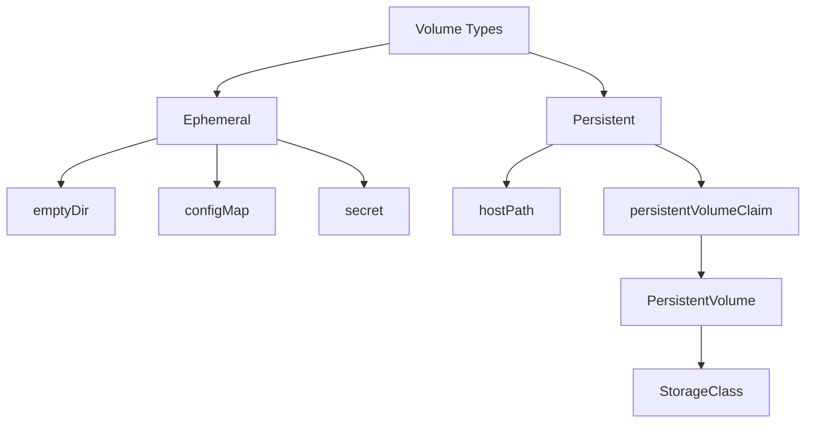
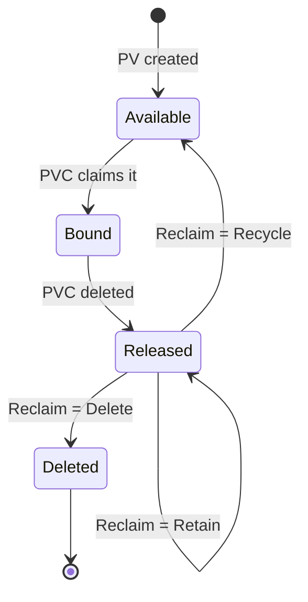
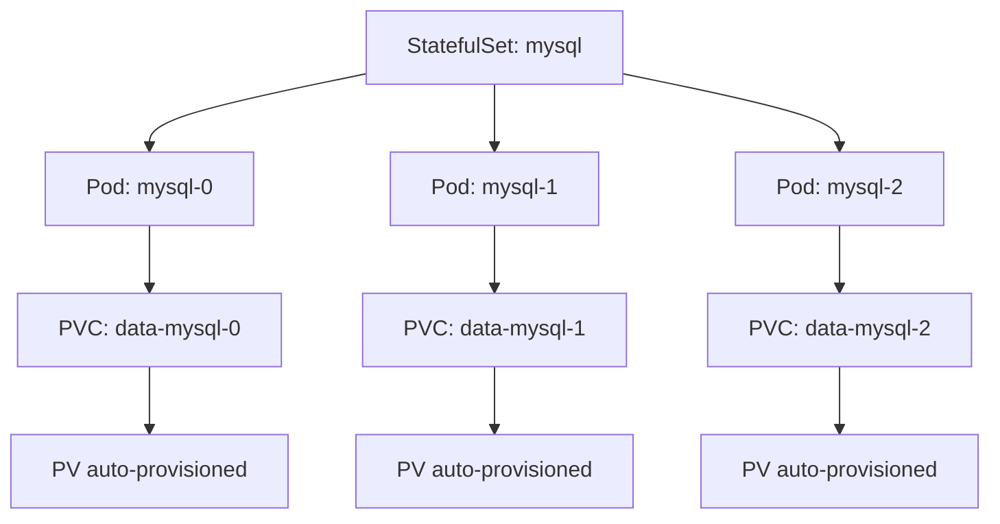
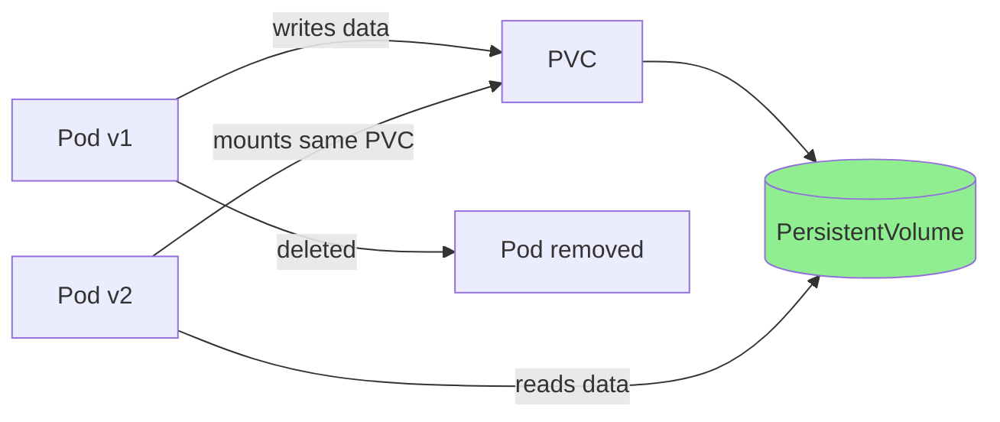

# Week 8: Persistent Storage & Volumes

## The Concept

Containers are ephemeral. When a container restarts, crashes, or is replaced, everything inside it is gone. The filesystem is temporary. This is fine for stateless apps, but many applications need to keep data across restarts: databases, file uploads, logs, configuration caches. Volumes solve this by giving Pods a place to store data that outlives the container.

Kubernetes offers several volume types:

**emptyDir** — A temporary directory created when the Pod starts. It is shared between all containers in the same Pod. When the Pod is removed, the volume and its data are deleted. Use it for scratch space, caches, or sharing files between init containers and main containers.

**hostPath** — Maps a directory from the node's filesystem into the Pod. Data lives on the node, not in the cluster storage layer. It is not portable: if the Pod moves to another node, the data stays on the old node. Not recommended for production.

**configMap / secret** — Mounts a ConfigMap or Secret as files or directories in the Pod. Useful for configuration and credentials, not for mutable application data.

**persistentVolumeClaim** — Connects the Pod to durable storage. The Pod requests storage via a PersistentVolumeClaim (PVC); Kubernetes binds it to a PersistentVolume (PV) or provisions storage dynamically.



A **PersistentVolume (PV)** is a piece of storage provisioned by an admin. Think of it as a hard drive available in the cluster. It has capacity, access modes, and a reclaim policy.

A **PersistentVolumeClaim (PVC)** is a request for storage by a Pod. Think of it as "I need a 5GB disk." The user specifies size, access mode, and optionally a StorageClass. Kubernetes matches the PVC to a suitable PV.

**Binding** — When a PVC is created, the control plane finds a PV that satisfies the request (capacity, access modes, StorageClass). If one exists, it binds the PVC to that PV. The PVC status becomes "Bound."



**Access modes** — Define how the volume can be used:
- **ReadWriteOnce (RWO)** — Read and write by a single node at a time. Most block storage (e.g., AWS EBS, GCP PD) supports this.
- **ReadOnlyMany (ROX)** — Read by many nodes simultaneously. Some file storage supports this.
- **ReadWriteMany (RWX)** — Read and write by many nodes. Typically NFS or similar file systems.

**Reclaim policies** — What happens to the PV when its PVC is deleted:
- **Retain** — Data is kept. Admin must manually delete or recycle the PV.
- **Delete** — The backing storage is destroyed. Data is lost.

A **StorageClass** defines how storage is provisioned dynamically. Instead of admins creating PVs by hand, a provisioner (e.g., AWS EBS, GCP PD) creates a PV when a PVC is created. The PVC references the StorageClass by name.

A **StatefulSet** is a workload API like Deployment, but it gives each Pod a stable identity (ordinal hostname like `mysql-0`, `mysql-1`) and its own PVC via `volumeClaimTemplates`. When a Pod is recreated, it gets the same PVC and thus the same data.



## Beginner Tutorial

### 1. Pod with emptyDir shared between two containers

```yaml
apiVersion: v1
kind: Pod
metadata:
  name: shared-volume-pod
spec:
  containers:
  - name: writer
    image: busybox
    command: ["sh", "-c", "echo hello-from-writer > /shared/data.txt && sleep 3600"]
    volumeMounts:
    - name: shared
      mountPath: /shared
  - name: reader
    image: busybox
    command: ["sh", "-c", "cat /shared/data.txt && sleep 3600"]
    volumeMounts:
    - name: shared
      mountPath: /shared
  volumes:
  - name: shared
    emptyDir: {}
```

```bash
kubectl apply -f shared-volume-pod.yaml
kubectl logs shared-volume-pod -c reader
# Output: hello-from-writer
```

### 2. Create a PV (hostPath for local clusters)

```yaml
apiVersion: v1
kind: PersistentVolume
metadata:
  name: my-pv
spec:
  capacity:
    storage: 1Gi
  accessModes:
    - ReadWriteOnce
  hostPath:
    path: /tmp/k8s-pv
  persistentVolumeReclaimPolicy: Retain
```

```bash
# On the node (or minikube ssh), create the directory:
# mkdir -p /tmp/k8s-pv

kubectl apply -f my-pv.yaml
```

### 3. Create a PVC

```yaml
apiVersion: v1
kind: PersistentVolumeClaim
metadata:
  name: my-pvc
spec:
  accessModes:
    - ReadWriteOnce
  resources:
    requests:
      storage: 500Mi
```

```bash
kubectl apply -f my-pvc.yaml
kubectl get pvc my-pvc
# STATUS should be Bound
```

### 4. Mount the PVC in a Pod and write data

```yaml
apiVersion: v1
kind: Pod
metadata:
  name: pv-pod
spec:
  containers:
  - name: app
    image: busybox
    command: ["sh", "-c", "echo persistent-data > /data/file.txt && sleep 3600"]
    volumeMounts:
    - name: data
      mountPath: /data
  volumes:
  - name: data
    persistentVolumeClaim:
      claimName: my-pvc
```

```bash
kubectl apply -f pv-pod.yaml
kubectl wait --for=condition=Ready pod/pv-pod --timeout=60s
```

### 5. Delete the Pod, create a new one, verify data persists

```bash
kubectl delete pod pv-pod
```

Create a new Pod that reads the data:

```yaml
apiVersion: v1
kind: Pod
metadata:
  name: pv-pod-2
spec:
  containers:
  - name: app
    image: busybox
    command: ["sh", "-c", "cat /data/file.txt && sleep 3600"]
    volumeMounts:
    - name: data
      mountPath: /data
  volumes:
  - name: data
    persistentVolumeClaim:
      claimName: my-pvc
```

```bash
kubectl apply -f pv-pod-2.yaml
kubectl logs pv-pod-2
# Output: persistent-data
```



### 6. Use the default StorageClass for dynamic provisioning

```yaml
apiVersion: v1
kind: PersistentVolumeClaim
metadata:
  name: dynamic-pvc
spec:
  accessModes:
    - ReadWriteOnce
  resources:
    requests:
      storage: 1Gi
  # storageClassName omitted = uses default StorageClass
```

```bash
kubectl apply -f dynamic-pvc.yaml
kubectl get pvc dynamic-pvc
kubectl get pv
# A new PV should be auto-created and bound
```

### 7. Deploy a StatefulSet with volumeClaimTemplates

```yaml
apiVersion: apps/v1
kind: StatefulSet
metadata:
  name: mysql
spec:
  serviceName: mysql
  replicas: 2
  selector:
    matchLabels:
      app: mysql
  template:
    metadata:
      labels:
        app: mysql
    spec:
      containers:
      - name: mysql
        image: mysql:5.7
        env:
        - name: MYSQL_ROOT_PASSWORD
          value: "secret"
        volumeMounts:
        - name: data
          mountPath: /var/lib/mysql
  volumeClaimTemplates:
  - metadata:
      name: data
    spec:
      accessModes: ["ReadWriteOnce"]
      resources:
        requests:
          storage: 1Gi
```

```bash
kubectl apply -f mysql-statefulset.yaml
```

### 8. Observe PVC names match Pod names

```bash
kubectl get pvc
# data-mysql-0, data-mysql-1
kubectl get pods
# mysql-0, mysql-1
```

## Hands-On Lab

### Challenge 1: Data Persistence

**Scenario:** Deploy a Pod that writes a file to a PVC. Delete the Pod. Create a new Pod using the same PVC. Verify the file is still there.

**Success criteria:** The second Pod can read the file written by the first Pod.

<details>
<summary>Hints</summary>

- Create a PV (hostPath) and PVC first.
- Mount the PVC in the first Pod at a path like `/data`.
- Write a unique string to a file in that path.
- Delete the first Pod, create a second Pod with the same PVC and mount path.
- Use `kubectl exec` or `kubectl logs` to read the file in the second Pod.
</details>

---

### Challenge 2: Shared Volume

**Scenario:** Create a Pod with 2 containers sharing an emptyDir. Container A writes a file, Container B reads it. Prove communication via the volume.

**Success criteria:** Container B outputs the exact content written by Container A.

<details>
<summary>Hints</summary>

- Define one `emptyDir` volume in the Pod spec.
- Mount it in both containers at the same path (e.g., `/shared`).
- Use `command` in the writer container to echo content to a file.
- Use `command` in the reader container to cat the file.
- Add `sleep` so both containers stay running long enough to observe.
- Check logs of the reader container.
</details>

---

### Challenge 3: MySQL StatefulSet

**Scenario:** Deploy MySQL as a StatefulSet with a PVC. Insert data, delete the Pod, let StatefulSet recreate it, verify data survived.

**Success criteria:** After Pod recreation, the inserted row is still present in the database.

<details>
<summary>Hints</summary>

- Use `volumeClaimTemplates` in the StatefulSet.
- Create a Headless Service (clusterIP: None) for the StatefulSet.
- Use `kubectl exec` to run `mysql` client and INSERT a row.
- Delete the Pod: `kubectl delete pod mysql-0`
- Wait for the new Pod to be Ready, then exec again and SELECT the row.
</details>

---

### Challenge 4: Dynamic Provisioning

**Scenario:** Create a PVC WITHOUT creating a PV first. Use the default StorageClass. Verify a PV is automatically created and bound.

**Success criteria:** After creating only the PVC, a PV exists and the PVC status is Bound.

<details>
<summary>Hints</summary>

- Do not create a PV manually.
- Create a PVC and omit `storageClassName` (or set it to the default StorageClass name).
- Run `kubectl get storageclass` to find the default (has `(default)` annotation).
- Run `kubectl get pv` and `kubectl get pvc` after creating the PVC.
- If no default StorageClass exists (e.g., bare metal), you may need to install one (e.g., local-path-provisioner).
</details>

---

## Weekly Speed Drill

1. Create a PV with 2Gi capacity
2. Create a PVC requesting 1Gi
3. Verify PV and PVC are bound
4. Create a Pod using that PVC
5. List all PVs and PVCs
6. Check StorageClasses available
7. Create a Pod with emptyDir volume
8. Create a ConfigMap and mount it as a volume
9. Delete a PVC and observe PV status (Released vs Available)
10. Create a PVC with a specific StorageClass

## Exam Pitfalls

- **PVC accessModes must match PV accessModes** — The PVC can request a subset (e.g., RWO when PV supports RWO and RWX), but not a superset. Mismatch prevents binding.

- **PVC storage request must be <= PV capacity** — A PVC requesting 2Gi cannot bind to a 1Gi PV.

- **Forgetting to specify storageClassName in PVC** — If you want a specific StorageClass, you must set it. Omitting it uses the default, which may not bind to the PV you expect.

- **Using hostPath in production** — Data is node-local. Pods on other nodes cannot access it. Not suitable for production workloads.

- **Deleting PVC before removing Pod reference** — If a Pod is still using a PVC and you delete the PVC, the Pod can get stuck in Terminating because the volume cannot be unmounted.

- **Confusing emptyDir with PVC** — emptyDir dies with the Pod. PVC survives Pod deletion. Use the right one for the use case.

- **StatefulSet volumeClaimTemplates** — PVCs created by volumeClaimTemplates are NOT deleted when the StatefulSet is scaled down. They persist. Scale down does not remove PVCs.

- **PV reclaim policy "Delete"** — When the PVC is deleted, the provisioner destroys the backing storage. Data is lost. Use Retain if you need to keep data.

## Solution Key

### Challenge 1: Data Persistence

**PV:**

```yaml
apiVersion: v1
kind: PersistentVolume
metadata:
  name: lab-pv
spec:
  capacity:
    storage: 1Gi
  accessModes:
    - ReadWriteOnce
  hostPath:
    path: /tmp/k8s-lab-pv
  persistentVolumeReclaimPolicy: Retain
```

**PVC:**

```yaml
apiVersion: v1
kind: PersistentVolumeClaim
metadata:
  name: lab-pvc
spec:
  accessModes:
    - ReadWriteOnce
  resources:
    requests:
      storage: 500Mi
```

**Pod 1 (writer):**

```yaml
apiVersion: v1
kind: Pod
metadata:
  name: writer-pod
spec:
  containers:
  - name: app
    image: busybox
    command: ["sh", "-c", "echo my-persistent-data > /data/persistent.txt && sleep 10"]
    volumeMounts:
    - name: data
      mountPath: /data
  volumes:
  - name: data
    persistentVolumeClaim:
      claimName: lab-pvc
```

**Commands:**

```bash
# Create directory on node if using hostPath (e.g., minikube ssh):
# mkdir -p /tmp/k8s-lab-pv

kubectl apply -f pv.yaml
kubectl apply -f pvc.yaml
kubectl apply -f writer-pod.yaml
kubectl wait --for=condition=Ready pod/writer-pod --timeout=60s
kubectl delete pod writer-pod
```

**Pod 2 (reader):**

```yaml
apiVersion: v1
kind: Pod
metadata:
  name: reader-pod
spec:
  containers:
  - name: app
    image: busybox
    command: ["sh", "-c", "cat /data/persistent.txt && sleep 3600"]
    volumeMounts:
    - name: data
      mountPath: /data
  volumes:
  - name: data
    persistentVolumeClaim:
      claimName: lab-pvc
```

```bash
kubectl apply -f reader-pod.yaml
kubectl logs reader-pod
# Expected: my-persistent-data
```

---

### Challenge 2: Shared Volume

```yaml
apiVersion: v1
kind: Pod
metadata:
  name: shared-lab
spec:
  containers:
  - name: writer
    image: busybox
    command: ["sh", "-c", "echo shared-message > /shared/msg.txt && sleep 3600"]
    volumeMounts:
    - name: shared
      mountPath: /shared
  - name: reader
    image: busybox
    command: ["sh", "-c", "cat /shared/msg.txt && sleep 3600"]
    volumeMounts:
    - name: shared
      mountPath: /shared
  volumes:
  - name: shared
    emptyDir: {}
```

```bash
kubectl apply -f shared-lab.yaml
kubectl logs shared-lab -c reader
# Expected: shared-message
```

---

### Challenge 3: MySQL StatefulSet

**Service:**

```yaml
apiVersion: v1
kind: Service
metadata:
  name: mysql
spec:
  clusterIP: None
  selector:
    app: mysql
  ports:
  - port: 3306
    name: mysql
```

**StatefulSet:**

```yaml
apiVersion: apps/v1
kind: StatefulSet
metadata:
  name: mysql
spec:
  serviceName: mysql
  replicas: 1
  selector:
    matchLabels:
      app: mysql
  template:
    metadata:
      labels:
        app: mysql
    spec:
      containers:
      - name: mysql
        image: mysql:5.7
        env:
        - name: MYSQL_ROOT_PASSWORD
          value: "secret"
        volumeMounts:
        - name: data
          mountPath: /var/lib/mysql
  volumeClaimTemplates:
  - metadata:
      name: data
    spec:
      accessModes: ["ReadWriteOnce"]
      resources:
        requests:
          storage: 1Gi
```

```bash
kubectl apply -f mysql-svc.yaml
kubectl apply -f mysql-ss.yaml
kubectl wait --for=condition=Ready pod/mysql-0 --timeout=120s

# Insert data
kubectl exec mysql-0 -- mysql -uroot -psecret -e "CREATE DATABASE IF NOT EXISTS lab; USE lab; CREATE TABLE IF NOT EXISTS t1 (id INT, msg VARCHAR(50)); INSERT INTO t1 VALUES (1, 'survives-restart');"

# Delete Pod
kubectl delete pod mysql-0

# Wait for recreation
kubectl wait --for=condition=Ready pod/mysql-0 --timeout=120s

# Verify
kubectl exec mysql-0 -- mysql -uroot -psecret -e "USE lab; SELECT * FROM t1;"
# Expected: 1 | survives-restart
```

---

### Challenge 4: Dynamic Provisioning

```yaml
apiVersion: v1
kind: PersistentVolumeClaim
metadata:
  name: dynamic-lab-pvc
spec:
  accessModes:
    - ReadWriteOnce
  resources:
    requests:
      storage: 1Gi
```

```bash
kubectl get storageclass
# Note the default (marked with (default))

kubectl apply -f dynamic-pvc.yaml
kubectl get pvc dynamic-lab-pvc
# STATUS: Bound

kubectl get pv
# A PV should exist, provisioned by the default StorageClass, bound to dynamic-lab-pvc
```

**Expected output (example):**

```
NAME              CAPACITY   ACCESS MODES   RECLAIM POLICY   STATUS   CLAIM                     STORAGECLASS
pvc-xxxxx         1Gi        RWO            Delete           Bound    default/dynamic-lab-pvc   standard
```
